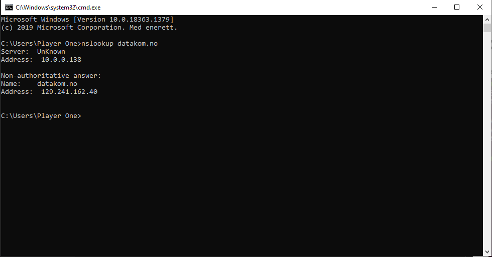
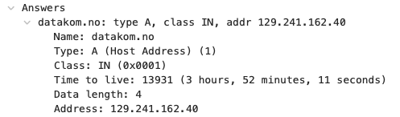
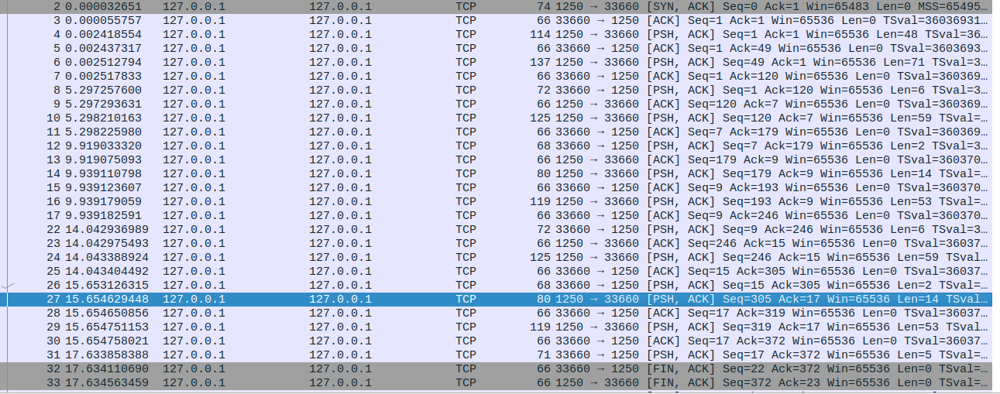
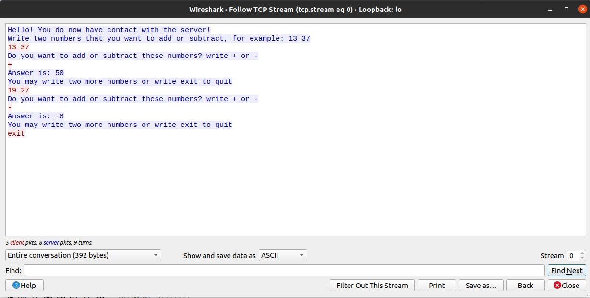
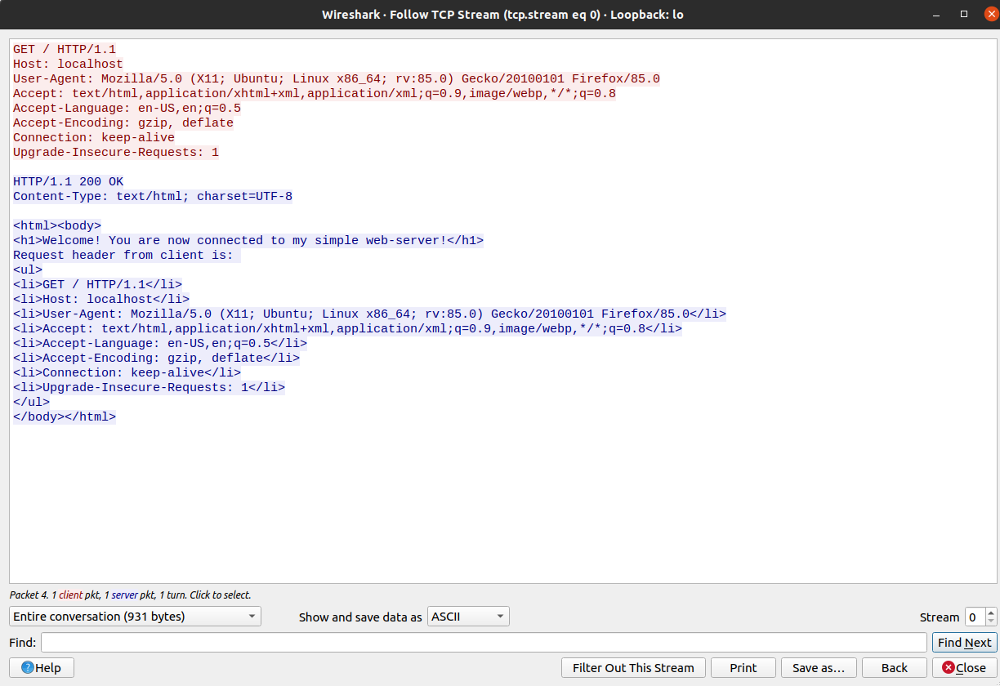
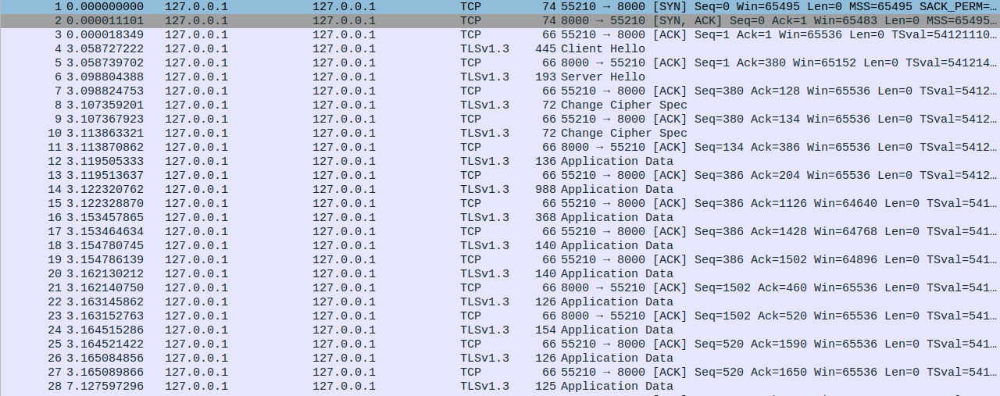
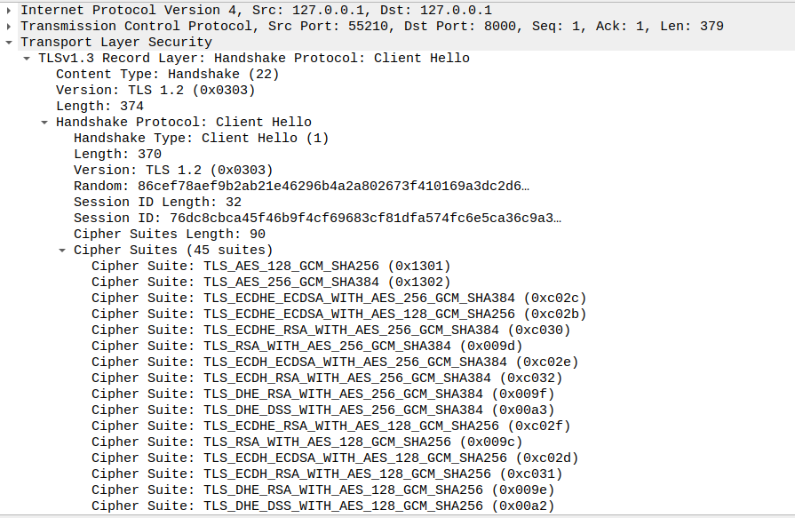
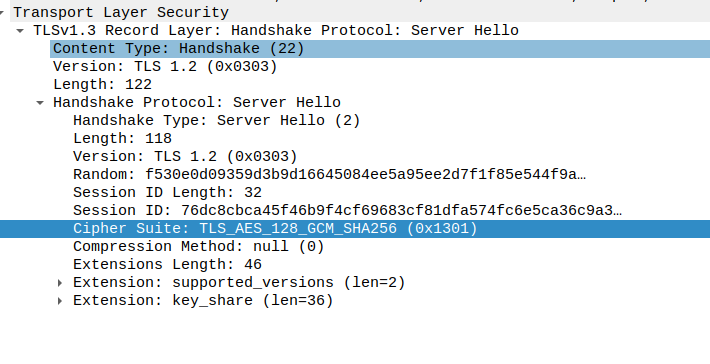
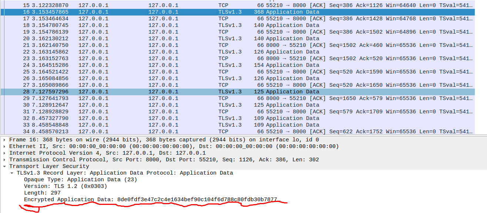

# Datakom øving 1

I denne øvingen har jeg samarbeidet med Mattias Agentoft Eggen

## Oppgave 1: Wireshark og DNS (10%)

a) 

Min lokale navnetjener er "UnKnown" som er fordi min ruter ikke er konfigurert rett. IP-addressen er 10.0.0.138 som er min ruters IP-addresse.

Resultatet fra nslookup på domenenavnet datakom.no er IP-addressen 129.241.162.40

b) 

Her står det at DNS servers har samme IP-addresse som vi fikk som lokal navnetjener fra nslookup. I tillegg ser vi at denne IP-addressen er den samme som ruterens IP-addresse som betyr at det er ruteren min som er min lokale navnetjener.

c)


Verdien på Type er A og levetid er 3 timer, 52 minutter, 11 sekunder. At det er type A betyr at den kommer fra host addressen som er 129.241.162.40. Levetiden vil si at den får "leve" i så lang tid før pakken blir slettet fra DNS cache.

d) Når jeg bruker kommandoen `nslookup datakom.no` så får jeg både IPv4 og IPv6 addresse til datakom.no, men annet enn dette så er det ikke behov for flere DNS-requester for å finne ut hvilke IP jeg skal koble opp mot.

## Oppgave 2: Wireshark og HTTP (15%)

a)

Header linjen vi sender er en GET request, `GET / HTTP/1.1`, som spør om index fila fra destinasjons IP-addressen: 129.241.162.40.
Svaret vi får er: `HTTP /1.1 304 Not Modified`, som betyr at index-filen vi spør etter ikke har endret seg siden sist vi mottok den, og det er derfor ikke nødvendig å hente samme pakke på nytt.
Dette kommer av at vi først gikk inn på datakom.no før vi åpnet wireshark, siden da har vi allerede index-fila lagret når vi besøker datakom.no på nytt.

Vi kan se på skjermbildet at tiden fra siste svar fra webtjeneren til det kommer en TCP pakke med FIN-flagget satt er ganske nøyaktig 5 sekunder. Dette kommer av at HTTP-requesten har en Keep-Alive med timeout verdi = 5, som betyr at den skal holde forbindelsen i 5 sekunder før den kobles ned. Dette er for å slippe å gjennomføre three-way-handshake flere ganger hvis det skal sendes flere pakker kort tid etter hverandre.

b) Klienten sender HTTP request med en headerlinje: `Cache-Control: max-age=0`. max-age=0 vil si at cachen alltid må revalideres og sjekke om den versjonen av index-fila som er lagret, faktisk er den siste versjonen. GET requesten har også en `If-Modified-Since: Wed, 23 Sep 2020 13.02.56 GMT` som kan sees på som datoen til index-fila som er i mellomlagret på PC'en. Når vi sender GET-requesten med disse headerlinjene, så sjekker webtjeneren om den er endret siden den nevnte datoen, og i dette tilfelle svarer tjeneren: `HTTP/1.1 304 Not Modified` som altså betyr at den IKKE er endret og vi har den nyeste versjonen mellomlagret.

## Oppgave 3: Wireshark og TCP (20%)

a)


Den første byten med nyttelast vil alltid ha sekvensnummer 1 fordi pakkene som har blitt sendt fram til da ikke har hatt noe nyttelast altså 0 bytes. Sekvensnummeret øker med antall bytes som er sendt i forrige pakke. Så når sekvensnummeret er 1(etter three-way-handshake), og pakker som sendes har 0 bytes med nyttelast så blir neste sekvensnummer blir dermed 1 + 0, som er 1. Derfor vil den første byten med nyttelast alltid ha sekvensnummer 1.

Kvitteringsnummeret vi vil få tilbake vil være 2 fordi kvitteringsnummer peker på sekvensnummeret til den neste byten som forventes fra motparten.

b)


Det vi ser her er en forespørslen fra en klient om å få index fila til datakom.no.
Først sender klient en HTTP GET request til webtjener. Tilbake får klienten først en kvittering om at "bestilling" er mottatt og deretter 4 pakker med 1460 bytes. Webtjener sitt sekvensnummer økes med 1460(antall bytes i nyttelasten) for hver pakke, mens kvitteringsnummer står fast på 638 fordi den ikke får noen pakker med nyttelast fra klienten underveis.
Etter de fire pakkene med nyttelast fra webtjeneren, sender klienten en kvittering uten nyttelast tilbake med sekvensnummer 638 og kvitteringsnummer 5841 som er en peker på neste byte som forventes. Dette er en bekreftelse på at den har mottatt de fire første pakkene. Helt til slutt sender webtjeneren tilbake siste delen av index fila og en HTTP response om at GET-requesten var en suksess!

## Oppgave 4: Nettverk subnetting (20%)

I denne oppgaven blir vi gitt et IPv4-nettverk a.b.c.0/24. Subenetting består av å dele IP-adressen inn i to deler, nettadresse og nodeadresse. Tallet bak `/`, som i dette tilfellet er 4, forteller oss hvor mange bits av IP-adressen som brukes til nettadresse-delen av IP-adressen. Nettadresse-delen til IP-adressen er felles for alle noder i et subnett.

Nodeadressen sin jobb er dermed å skille mellom klientene i subnettet. Siden vi har 24 bits til nettadressen, så har vi 8 bits til nodeadresser. 8 bits tilsvarer 256 ulike nodeadresser, fra a.b.c.0 og helt opp til a.b.c.255. Derimot så er den første adressen referert til nettadressen og den siste addressen reservert til broadcast til alle klienter på subnettet. Dermed så er det kunde a.b.c.1 - a.b.c.254 som er tilgjengelig som nodeadresser.

For hver bit man legger til i nettadressen, så halveres antall plasser i subnettet. En god illustrasjon for hvordan subnettene blir delt opp avhengig av antall bit i nettmasken er dette bildet:


I denne oppgaven har vi fått beskjed om å dele opp dette IPv4 nettverket opp i subnett med antatt følgende behov:

- 80 ansatte
- 10 tjenermaskiner
- 20 gjestebrukere

Her har vi en figur vi tegnet for å illustrere hvordan vi delte opp subnettene ut i fra oppgavens behov:


Og her er tabellen med informasjon om de forskjellige subnettene.


## Oppgave 5: Dokumentasjon av Programmeringsøving 1

### - Tråder og socketprogrammering

**Øvingens del 1: Enkel tjener/klient (kalkulator)**

a)
Vi kan starte med å vise utvekslingen av data mellom tjener og klient fra tjenersiden:

```Java
        input = new InputStreamReader(this.client.getInputStream());
        reader = new BufferedReader(input);
        writer = new PrintWriter(client.getOutputStream(), true);

        writer.println("Hello! You do now have contact with the server!");
        writer.println("Write two numbers that you want to add or subtract, for example: 13 37");


        String line = reader.readLine();
        while(!line.equals("exit")){
            String[] numbers = line.split(" ");
            int number1 = Integer.parseInt(numbers[0]);
            int number2 = Integer.parseInt(numbers[1]);

            writer.println("Do you want to add or subtract these numbers? write + or -");
            String userInput = reader.readLine();

            if(userInput.equals("+")){
                writer.println("Answer is: " + (number1 + number2));
                writer.println("You may write two more numbers or write exit to quit");
            }else{
                writer.println("Answer is: " + (number1 - number2));
                writer.println("You may write two more numbers or write exit to quit");
            }
            line = reader.readLine();
        }
```

Øverst har vi en reader og en writer som håndterer lesing fra og skriving til klient. Vi skriver først en velkomstbeskjed til klient og deretter en while loop som lar klient skrive inn regnestykker og motta svaret helt til klient skriver `exit`. `reader.readLine();` leser data som klienten skriver til serveren, og `writer.println();` skriver til klienten.

Her kommer koden hos klienten:

```Java
        try {
            Scanner in = new Scanner(System.in);
            this.connection = new Socket(serverName, port);
            System.out.println("Connection established!");

            input = new InputStreamReader(connection.getInputStream());
            reader = new BufferedReader(input);
            writer = new PrintWriter(connection.getOutputStream(), true);

            String introLine1 = reader.readLine();
            String introLine2 = reader.readLine();
            System.out.println(introLine1 + "\n" + introLine2);

            String inputLine = in.nextLine();
            writer.println(inputLine);

            while(!inputLine.equals("exit")){
                String respons = reader.readLine();
                System.out.println("From server: " + respons);

                inputLine = in.nextLine();
                writer.println(inputLine);

                String answer = reader.readLine();
                String question = reader.readLine();
                System.out.println("From server: " + answer + "\n" + question);

                inputLine = in.nextLine();
                writer.println(inputLine);
            }

            reader.close();
            writer.close();
            connection.close();
        }
```

Her har vi også en reader og en writer som fungerer på samme måte som hos tjeneren. I tillegg har vi en Scanner som tar inn input fra klienten, og sender det til tjeneren. Klienten starter med å lese velkomstmelding fra tjener og starter deretter å sende regnestykker som den får svar på fra tjeneren, helt til klienten skriver exit og bryter while loopen.

Her er et skjermklipp av pakkefangsten:


Her får vi både med oss oppkoblingen i starten med three-way-handshake(bortsett fra første pakke fra klienten til tjeneren med SYN flagg), pakkene som blir sendt fram og tilbake, og til slutt nedkoblingen. 1250 er porten til tjeneren og 33660 er klienten sin port.

Til slutt har vi bildet av meldingsinnholdet i klartekst som vi får ved å bruke "follow TCP-stream":

Det i rødt er pakkeinnhold fra klient og det i blått er pakkeinnhold fra tjener.

**Øvings Del 2: Enkel webtjener (returnere HTTP-header)**

Her har vi pakkeutvekslingen mellom webtjener og klient:


Vår WebServer kjører på port 80, og klienten har port 41908. Først sender klient en pakke(nr 1) med SYN flagg som er en forespørsel om å opprette forbindelse med web-serveren. Web-serveren svarer(nr 2) med et SYN flagg tilbake og en kvittering på at den har mottatt forespørselen om oppkobling. Deretter svarer(nr 3) klient med en kvittering tilbake som sier at den mottok forrige pakke fra web-serveren. Siden kvitteringsnumre peker på neste forventede byte og pakkene fram til nå har hatt ingen nyttelast, altså 0 bytes, så er kvitteringsnummeret 1 hele tiden. Dette er three-way-handshake.

Etter forbindelsen er etablert så sender(nr 4) klienten en GET forespørsel om å få index-fila fra web-serveren. Web-serveren svarer(nr 5 og 6) ved å sende en kvitteringspakke om at GET-forespørselen er mottatt og deretter første pakke med nyttelast. Så sender(nr 7) klienten tilbake en bekreftelse om at den har fått de to pakkene, og sender med et kvitteringsnummer som peker på neste forventene byte. I dette tilfellet så inneholdt pakken 603 bytes i nyttelasten og kvitteringsnummeret er derfor 604.

Til slutt svarer(nr 8) web-serveren at GET-requesten var en suksess og begge partene kobler deretter ned forbindelsen.

Her har vi bilde av GET forespørslene i klartekst:


Rød skrift er klient og blå skrift er web-server.

b)

Her er koden for web-serveren:

```Java
        try{
            input = new InputStreamReader(client.getInputStream());
            reader = new BufferedReader(input);
            writer = new PrintWriter(client.getOutputStream());

            StringBuilder requestBuilder = new StringBuilder();
            String line;

            while(!(line = reader.readLine()).isBlank()){
                requestBuilder.append(line + "\r\n");
            }

            String[] request = parseRequest(requestBuilder.toString());
            System.out.println(requestBuilder.toString());


            writer.print("HTTP/1.1 200 OK\r\n");
            writer.print("Content-Type: text/html; charset=UTF-8\r\n\r\n");

            writer.print("<html><body>\r\n");
            writer.print("<h1>Welcome! You are now connected to my simple web-server!</h1>\r\n");
            writer.print("Request header from client is: \r\n");
            writer.print("<ul>\r\n");
            for(int i = 0; i < request.length; i ++){
                writer.print("<li>" + request[i] + "</li>\r\n");
            }
            writer.print("</ul>\r\n");
            writer.print("</body></html>\r\n");
            writer.print("\r\n\r\n");

            writer.flush();

            System.out.println("Welcome message sent.");

        }catch(IOException e){
            e.printStackTrace();
        }finally{
            if(reader != null){
                try{
                    reader.close();
                }catch(IOException e){
                    e.printStackTrace();
                }
            }
            if(writer != null){
                writer.close();
            }
            try{
                client.close();
            }catch(IOException e){
                e.printStackTrace();
            }
        }
```

Vi kan se web-serveren først leser inn GET forespørselen og deretter svarer ved å skrive tilbake index fila i klartekst med klienten sin GET-forespørsel som innhold. Til slutt lukker den reader og writer og forbindelsen.

Her er bilde av nedkoplingen i wireshark:


Selvo om man ikke ser det på bildet så har `HTTP/1.1 200 OK` HTTP pakken et FIN og SYN flagg som signaliserer til web-server om at forbindelsen skal kobles ned. Webserveren svarer i neste pakke med et FIN flagg og et kvitteringsnummer som er inkrementert med 1 pga. SYN flagget. Til slutt sender web-serveren et svar om at forrige pakke ble mottatt.

## Oppgave 6 - Revisjon TLS

a)

Tjener og klient settes opp på samme måte som tidligere klient-tjener systemer, bortsett fra at nå bruker tjeneren SSLServerSocket istedenfor kun ServerSocket og klient bruker SSLSocket istedenfor socket. Når det kommer til skriving til og lesing fra hverandre er koden veldig lik.

SSL fungerer ved at klient og tjener oppretter en SSL forbindelse gjennom et "SSL Handshake" som gjøres ved hjelp av SSL sertifikater og nøkler. Man har en privat og en offentlig nøkkel som brukes til å lage en kryptert forbindelse mellom klient og tjener. Klient spør først tjener om å lage en SSL forbindelse, tjener svarer med sin offentlige nøkkel og sitt SSL sertifikat. Klienten sikrer seg om at tjeneren er legitim og lager en felles sesjonsnøkkel og sender den til tjeneren. Tjeneren dekrypterer nøkkelen med sin private nøkkel, krypterer nyttelasten som skal til klientene med den fellese sesjonsnøkkelen, og sender denne til klienten. Klienten dekrypterer dette ved hjelp av den fellese sesjonsnøkkelen og kan dermed lese nyttelasten.

Den private nøkkelen er lagret på pc'en i en skjult fil, slik at den ikke skal komme på avveie.

b)

Her er bilde fra wireshark av forbindelsen mellom tjeneren og klient:

Fra pakke nummer 1 til 3, så ser vi den kjente three-way-handshake. Deretter sender klienten en forespørsel om å åpne en SSL-forbindelse. I denne forespørselen sender også en liste av cipher suites som den aksepterer. Her er et skjermbilde av noen av dem:

Tjeneren svarer med å sende en kvittering på at den har motatt pakken, og sender deretter en Server Hello som inneholder hvilken cipher suite som skal brukes, som i dette tilfelle er SHA-algoritmen, og sitt sertifikat og offentlige nøkkel. Disse pakkene er kjent som en del av Handshake Protocol. Her kan man se tjeneren sin cipher suite:

Etter disse pakkene sendes det pakker med Change Cipher Spec Protocol som ofte sees på som en del av handshake-protokollen og det er her de bytter til den fellese sesjon-nøkkel krypteringen.

Pakkene som kommer etterpå er nå kryptert og det kan man se for eksempel på dette skjermbildet:

