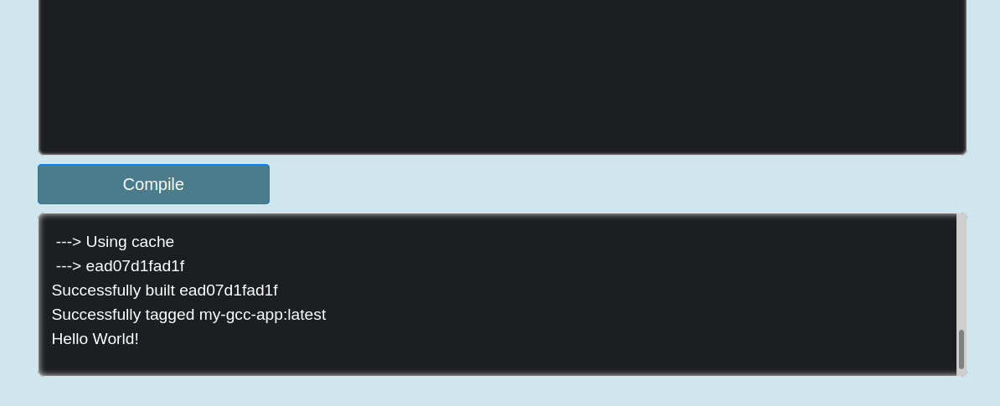
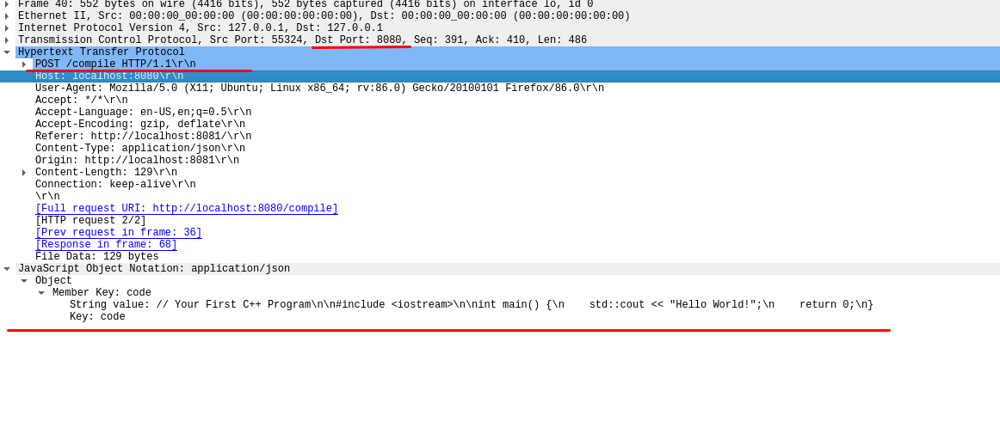
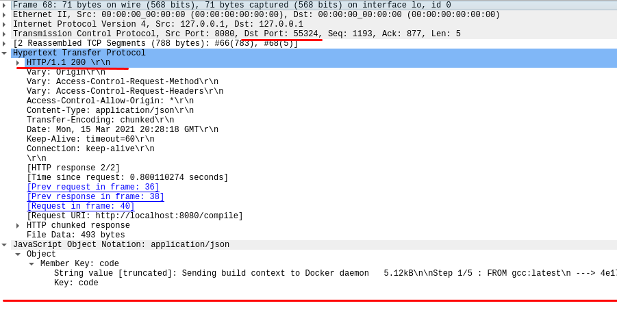

# IDATT2104 – Oblig DKO 2

## Oppgave 1 - Adressering

## Oppgave 2 - MAC-adresser og ARP

a) Address Resolution Protocol(ARP) er en protokoll hvor hensikten er å finne en nodes MAC-adresse ved hjelp av IPv4-adresse. Hovedgrunnen til at man vil ha tak i MAC-adressen er fordi maskiner på samme subnett bruker hverandres MAC-adresser til å kommunisere.

b) ARP-forespørsler inneholder mottakerens IPv4-adresse og blir sendt til alle MAC-adressene som er koblet til det lokale nettverket. Noden med riktig IPv4-adresse svarer ved å sende tilbake sin MAC-adresse til avsenderen for å starte kommunikasjonen.

Det som kjennetegner enheter som er mottakere av disse er at de er koblet på det samme lokale nettverket.

c) For å finne MAC-adressen til min laptop måtte jeg pinge min laptops lokale IPv4-adresse (10.0.0.14), fra min stasjonære PC som også er koblet på det lokale nettverket, for å opprette en forbindelse. Jeg sendte ping kommandoen fra min stasjonære pc som har Windows 10 OS. Her er ping kommandoen:


Etterpå kjører jeg kommandoen `arp -a` for å få opp ARP-cache tabellen og får dette resultatet:


Her ser vi at min laptop som har den lokale IPv4-adressen 10.0.0.14 har MAC-adresse dc-71-96-9a-f0-83. MAC-adresse består av to deler hvor den første halvdelen gir oss hvem som er produsenten av nettverkskortet, og andre halvdel består av et nummer som identfiserer dette nettverkskortet blant andre nettverkskort fra samme produsent.

Jeg søker opp dc-71-96 på google og får dette resultatet:


Produsenten av laptopen min mitt nettverkskort er Intel Corporate som stemmer når jeg sjekker hardwareinformasjonen på laptopen min.

## Oppgave 3 - IPv6


## Oppgave 4 - DHCP

a) Jeg kjørte først kommandoen ```ipconfig /release```. Startet opp wireshark og la til displayfilteret ```DHCP``` og kjørte deretter kommandoen ```ipconfig /renew``` og fikk disse 4 pakkene opp i wireshark:


Første pakke fra klient: 


Andre pakke fra server: 


Tredje pakke fra klient: 


Første pakke fra server: 


Her har vi en tabell-oversikt over addressene til de 4 pakkene som blir utvekslet:


Oppsummering fra tabell:

1. Hvilken MAC-adresser sendes alle pakker til: ```FF:FF:FF:FF:FF:FF```
2. Hvilken IP-adresse sendes alle pakker til: ```255.255.255.255```
3. Hvilken IP-adresse sender klienten fra:  ```0.0.0.0```


b) Her har vi option (1), option (3) og option (6) som er andre konfigurasjoner som settes for PC'en under DHCP protokollen. Option (1) setter PC'ens nettmasken. Option (6) setter IP-adressen til DNS. Option (3) setter default ruter for dette interfacet. 

I mitt tilfelle er subnet-masken(option 1) ```255.255.255.0```, IP-adressen til DNS(option 6) ```10.0.0.138``` og IP-adressen til default ruter(option 3) er ```10.0.0.138```.


## Prog-øving - Virtualisering

### Øvingens hensikt

Hensikten med denne øvingen var å lage en nettside hvor brukeren kunne skrive inn kode i c++ kode i et tekstfelt, og deretter få utskriften av kompileringen og programmet. Poenget med øvingen var å få sendt denne koden til en server hvor man brukte docker til å kompilere koden og opprette en container som prøvde å kjøre koden om kompileringen var vellykket. Grunnen til at vi måtte kjøre koden i en docker-kontainer var for å forhindre at brukerens kode skal kunne gjøre noe endringer eller evt. skade pc'en som serveren kjører på.

### Ordforklaringer

**Docker:** Docker er et verktøy som lar oss opprette kontainere som inneholder kun informasjonen(libraries og dependencies osv.) som er nødvendig for sitt formål. Kontainerne kan deretter feks. kjøre applikasjoner eller teste applikasjoner. Docker er veldig nyttig for å blant annet implementere continous integration.

**Docker image og docker kontainer:** Docker image er et sett med filer som ikke har noe state, mens docker container er instansen av docker imaget.

**Dockerfile:** Dockerfile er en fil som inneholder instruksjoner for hva slags OS, dependencies, libraries, kommandoer et image skal bestå av. Man kjører ```docker build (options) (navnet på dockerfilen)``` og får deretter et kjørbart docker image som kan kjøres med ```docker run ...```

**POST - HTTP request:** I oppgaven brukes en POST HTTP request for å sende koden fra frontend til serveren. POST betyr at den inneholder en body med data, som i dette tilfellet er koden som skal kompileres og kjøres.

### Program og datakommunikasjon

Slik ser frontend ut: 


Vi kan starte med å se på koden. Viktigste delen av koden i frontend er denne kodesnutten:

```javascript
    // Simple POST request with a JSON body using fetch
    const requestOptions = {
    method: "POST",
    headers: { "Content-Type": "application/json" },
    body: JSON.stringify(code)
    };

    fetch("http://localhost:8080/compile", requestOptions)
    .then(response => response.json())
    .then(data => {
        console.log(data);
        document.querySelector("#code-output").value = data.code;
    })
    .finally(() => {
        compileButton.style.backgroundColor = "#4b7c8b";
        compileSpinner.style.display = "none";
    });
```

Her ser vi POST requesten som vi snakket om i avsnittet over. ```requestOptions``` definerer at det er en POST request og setter at body'en består av koden.
 ```fetch(..., ...)``` er en asynkron metode som sender en HTTP request til URL'en den får inn. Den får til slutt svar fra serveren som blir logget og puttet inn i Output tekstomådet i frontend. Svaret den får er da den outputen fra kompileringen og programmet som kjøres i docker containeren.

I serveren, som er en spring boot application, har vi først kontroller klassen som tar i mot requesten med ```/compile``` som mapping. Her er metoden i kontroller klassen:

```java
@PostMapping(path = "/compile")
public CodeDTO codeCompiler(@RequestBody CodeDTO code){
    logger.info(code.getCode());
    return codeCompilerService.compileCode(code);
}
```

Denne metoden leser body'en fra POST requesten, putter den inn i et object ```CodeDTO``` som er en enkel klasse med en ```String``` attribute som skal representere koden:

```java
package magnbred.ntnu.oblig5.cppcompiler.dockercompiler.model;

public class CodeDTO {

    private String code;

    public CodeDTO(){}

    public CodeDTO(String code) {
        this.code = code;
    }

    public String getCode() {
        return code;
    }

    public void setCode(String code) {
        this.code = code;
    }

    @Override
    public String toString() {
        return "CodeDTO{" +
                "code='" + code + '\'' +
                '}';
    }
}
```

Metoden sender deretter objektet til service som sender objektet videre til repoet hvor magien skjer. Vi har metoden ```codeCompiler(CodeDTO code)``` ser slik ut:

```java
public CodeDTO codeCompiler(CodeDTO code){
        writeProgramToFile(code.getCode());

        ProcessBuilder processBuilder = new ProcessBuilder();
        processBuilder.command("bash", "src/main/resources/docker-script.sh");
        processBuilder.redirectErrorStream(true);

        ...
    }
```

Den skriver først koden fra objektet til en fil. Deretter utfører den kommandoen ```bash src/main/resources/docker-script.sh``` som kjører shell scriptet som ser slik ut. 

```sh
#!/bin/bash
cd src/main/resources || exit
docker build -t my-gcc-app . && docker run --rm my-gcc-app
```

Det som skjer her er at den bytter working directory til resources mappen, deretter prøver den å builde docker imaget fra Dockerfilen "my-gcc-app" og hvis dette går fint så kjøres docker imaget også.

Dockerfilen som sier hvordan docker imaget skal se ut ser slik ut:

```Dockerfile
FROM gcc:latest
COPY . /src/myapp
WORKDIR /src/myapp
RUN g++ -o myapp programToCompile.cpp
CMD ["./myapp"]
```

Til slutt så kjøres resten av ```codeCompiler(CodeDTO code)``` som ser slik ut:

```java
    StringBuilder output = new StringBuilder();

    try {
        Process process = processBuilder.start();

        BufferedReader processReader = new BufferedReader(new InputStreamReader(process.getInputStream()));

        String processLine;
        while((processLine = processReader.readLine()) != null){
            logger.info(processLine);
            output.append(processLine).append("\n");
        }

        process.waitFor();
        logger.info("Ok!");
    } catch (Exception e) {
        e.printStackTrace();
    }
    return new CodeDTO(output.toString());
```

Her fanges all outputen fra ```docker build``` og ```docker run``` og puttes inn i en ```String``` som til slutt sendes tilbake til frontend applikasjonen og blir håndtert der.

Her ser vi resultatet i frontend: 



Vi kan også se POST HTTP requesten fra klienten til serveren, og HTTP svaret fra serveren til klienten ved å bruke pakkefangst. Vi har brukt wireshark. Her har vi bilde av POST HTTP requesten:



Vi ser ```Dst Port: 8080``` som stemmer med at serveren vår kjører på port 8080. Man kan se POST Requesten til /compile som stemmer med kontroller mappingen vår. Nederst ser vi koden vi sender i body'en som skal kompileres og kjøres.

Her har vi et bilde svaret fra server til klient:



Vi ser nå at ```Dst Port: 55324``` som er klienten vår sin port og at ```Src Port: 8080``` som er serveren. HTTP requesten har status 200 som betyr OK. Nederst ser vi responsen fra serveren til klienten som består av outputen fra kompileringen og programmet.

### Sammendrag

Øvingen var veldig åpen og gjorde det derfor vanskelig å vite hvor man skulle starte, men etter litt research og først var i gang med øvingen så var det en veldig kul øving! Det jeg vil ta med meg videre er hvordan man kommuniserer mellom frontend og backend, bruk av shell script selv om det ikke var obligatorisk, og hvordan docker brukes i praksis. Alt i alt en veldig lærerik og kreativ øving.
