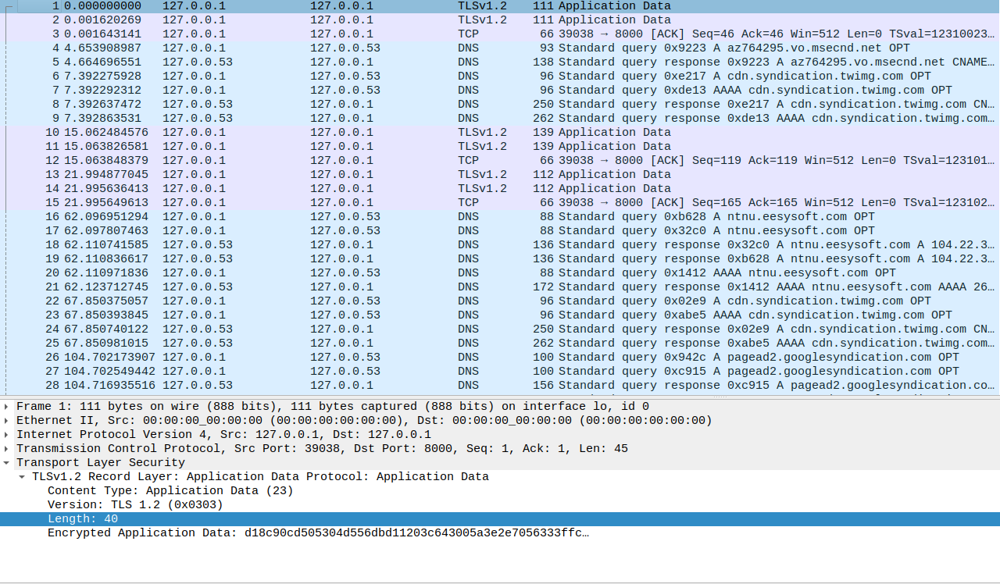

# Oblig 2 - Oppgave 2 - TSL

Wireshark capture when I use the loopback interface:

A snippet from the JavaSSLServer code showing that the server is using port 8000:

In the wireshark picture you can see in the column to the right most, there is traffic going on between port 8000, the server, and port 39038, the client. We can also see that the application data is enctrypted using TLSv1.2. In other words we can't see what is written from the server to the client and the other way around and the transport layer security is working!